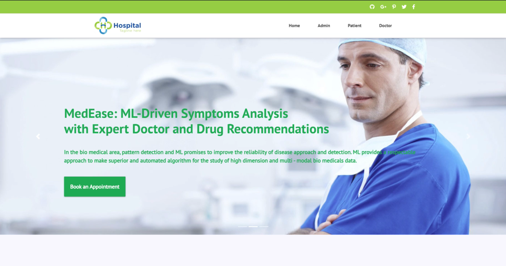

# 🩺 MED EASE: ML-Driven Symptom Analysis with Expert Doctor and Drug Recommendation

MED-EASE is an AI-powered web application designed to analyze patient symptoms and provide predictive diagnosis using machine learning. It integrates an expert recommendation system for doctors and appropriate medications based on user inputs. Built using Python, Flask, MySQL, and ML models, this tool bridges the gap between patients and healthcare accessibility.

---

## 🔍 Core Functionalities

- 🔍 **Symptom-Based Disease Prediction**
- 👨‍⚕️ **Doctor Recommendation System**
- 💊 **Drug Suggestion Module**
- 🖼️ **Profile Image Upload with Registration**
- 🧠 **Trained ML Model for Classification**
- 🧾 **Patient & Doctor Registration System**
- 📊 **Performance Metrics Dashboard (Precision, Recall, F1 Score)**

---

## 📂 Project Structure

```
MED-EASE/
├── Database/        
├── dataset/                 
├── profilepic/               
├── static/                  
├── templates/                
├── disease.model             
├── index.py                  
├── DBConnection.py           
├── patient_registration.py   
├── doctor_registration.py    
├── disease_detection.py      
├── ML_Evaluations.py         
├── symptoms_list.py          
├── precision.png             
├── recall.png              
├── fscore.png                
```

---

## 🧠 Technologies Used

- Python 3.11+
- Flask (Web Framework)
- MySQL / MariaDB (Database)
- scikit-learn (ML model)
- HTML5, CSS3, Bootstrap
- SQLYog / XAMPP (Database Management)
- PIL (Image Processing)
- joblib (Model saving)
- matplotlib (Visualization)

---

## 📊 Machine Learning Model

- ✅ **Accuracy:** 95%
- 🔁 **Model:** Trained using DecisionTreeClassifier + Manual Feature Engineering
- 📥 Input: List of symptoms
- 📤 Output: Predicted disease label + Suggested doctor & drug

---

## 🔧 Getting Started

### 1️⃣ Clone the Repo

```bash
git clone [https://github.com/UmarJaveedAltaf/MediBot-ML-Diagnosis.git](https://github.com/UmarJaveedAltaf/Med-Ease-ML-Driven-Symptom-Analysis-with-An-Expert-Doctor-and-Drug-Recommendation-System.git)
cd Med-Ease-ML-Driven-Symptom-Analysis-with-An-Expert-Doctor-and-Drug-Recommendation-System
```

### 2️⃣ Set up the Python Environment

```bash
python -m venv medenv
medenv\Scripts\activate      # On Windows
pip install -r requirements.txt
```

### 3️⃣ MySQL Setup

- Start **XAMPP** and make sure **MySQL** is running.
- Use **SQLYog** or **phpMyAdmin** to create a new database:

```sql
CREATE DATABASE disease_prediction;
```

- Tables will be auto-created on first registration OR use provided SQL scripts in `/Database`.

### 4️⃣ Run the App

```bash
python index.py
```

Open browser and go to: [http://localhost:2345](http://localhost:2345)

---

## 📸 Screenshots

| 🏠 Home Page | 👤 Patient Login Page | 👨‍⚕️ Doctor Login Page |
|-------------|------------------------|-------------------------|
|  |  |  |

| 🛡️ Admin Dashboard | 🧾 Admin Portal |
|---------------------|-------------------|
|  |  |


---

## 📚 How It Works

1. **User Registers** – Patient fills form with symptoms & uploads image.
2. **Model Predicts** – Disease predicted using ML model.
3. **System Responds** – Recommended doctor & drug shown.
4. **Data Stored** – Info saved in MySQL DB with profile image.

---

## 💡 Future Scope

- 🔗 Integrate real-time doctor availability
- 🤖 Upgrade model with deep learning
- 🌐 Deploy on Heroku/AWS
- 📱 Create responsive PWA or Android App

---

## 🤝 Authors

- **Umar Javeed Altaf** – `altafumar637@gmail.com`
- **Ayesha Siddiq** – `ayeshamadar20@gmail.com`
- **Shaammah Firdous** – `shamamah86@gmail.com`

> > Guided by: **Mrs. Saba Sheiba**, Department of Computer Science and Artificial Intelligence, Muffakham Jah College of Engineering and Technology, affiliated to Osmania University, Hyderabad, Telangana, India.


---

## 🧾 License

This project is licensed under the MIT License. See [LICENSE](LICENSE) for details.

---

## 🤝 Contributing

Contributions are always welcome!

1. Fork the repository
2. Create a new branch (`git checkout -b feature/your-feature-name`)
3. Commit your changes
4. Push to your branch (`git push origin feature/your-feature-name`)
5. Open a Pull Request

If you found this project useful, please ⭐ the repo!

---

## 🙌 Acknowledgements

- Thanks to scikit-learn and Flask contributors.
- Inspired by real-world healthcare gaps.
- Dataset adapted from UCI Repository (manually labeled symptom–disease mappings).

---
